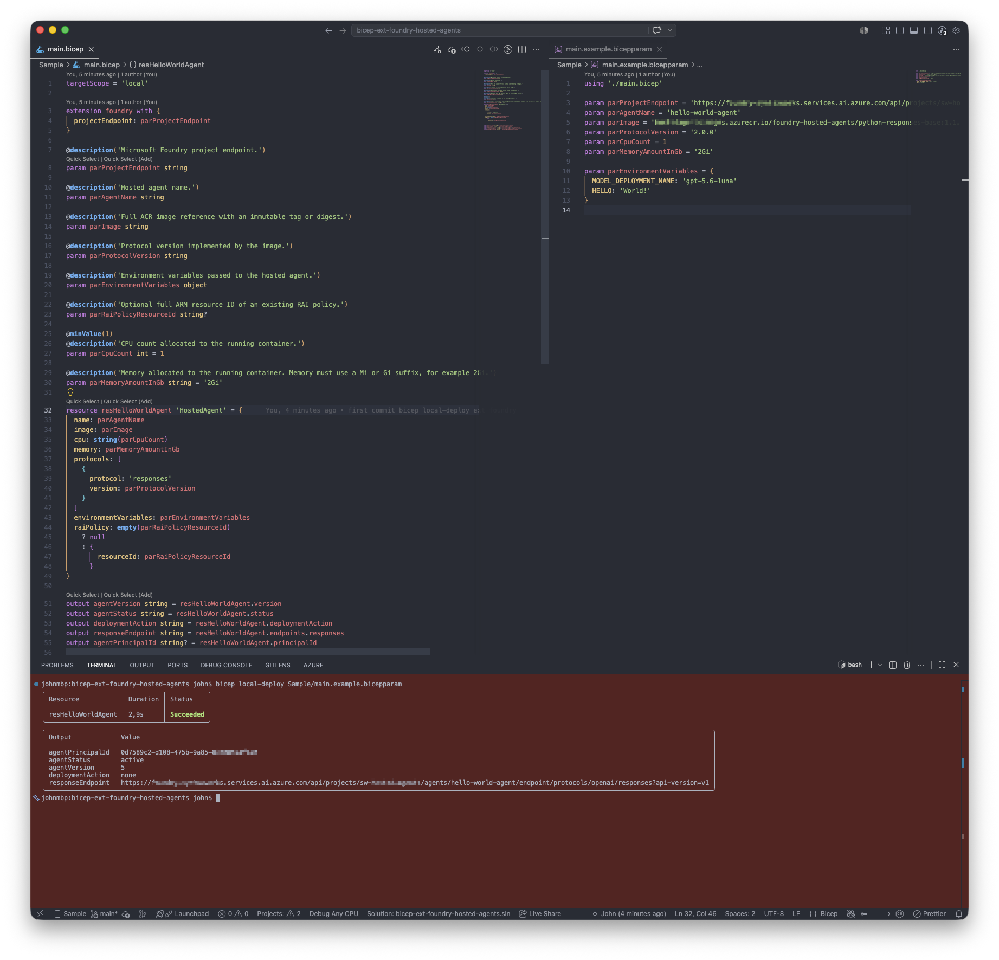
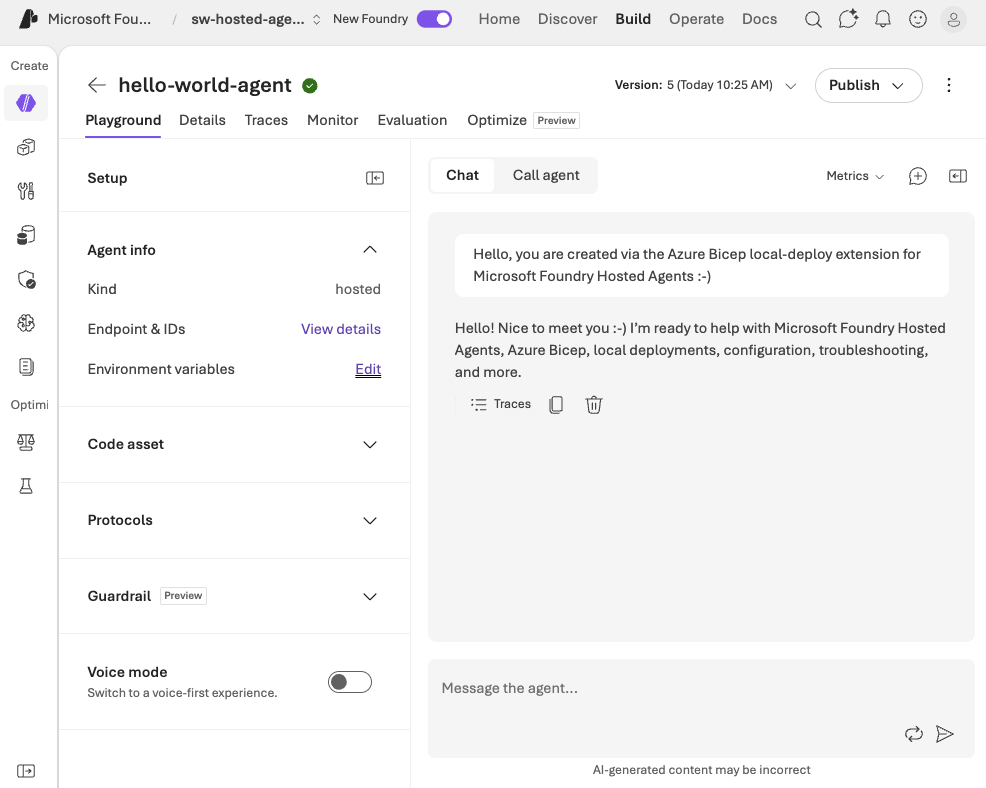

# Microsoft Foundry Hosted Agents Bicep Local Extension

This experimental extension deploys container-based Microsoft Foundry Hosted Agents through the Foundry data-plane REST API from a Bicep local deployment. This extension makes use of the Microsoft Foundry Hosted Agents REST API.

> [!WARNING]
> Bicep local deploy is a preview feature. Use this project for experimentation, not production workloads.

## Overview

This extension allows you to manage Microsoft Foundry Hosted Agents using Bicep local deployments. It simplifies the process of creating, updating, and deleting hosted agents. You define the Azure Bicep template and parameters, and the extension handles the deployment to Microsoft Foundry:



It results in a hosted agent with an immutable version that can be used in your Microsoft Foundry project:




## Capabilities

- Creates a hosted agent and its first immutable version.
- Creates a new version only when the desired definition changes.
- Supports ACR image, CPU, memory, Responses/Invocations protocols, environment variables, and an optional RAI policy guardrail.
- Polls until the version is `active` and surfaces provisioning errors.
- Deletes the complete logical agent and all its versions.
- Uses Microsoft Entra authentication through `DefaultAzureCredential`; no access token is stored in Bicep.

Direct source-code upload, traffic routing, draft versions, and prompt agents are intentionally outside the initial scope.

## Prerequisites

- .NET SDK 10.
- Bicep CLI 0.45.15 or later.
- A pre-existing Microsoft Foundry project.
- A Linux `amd64` hosted-agent image in ACR.

The deploying identity needs **Foundry Project Manager** on the Foundry project. The Foundry project's managed identity needs **Container Registry Repository Reader** on the registry or repository so the platform can pull the image. If you use ACR with RBAC role assignments then you can use **AcrPull**. The identity running `az acr build` also needs permission to run ACR Tasks builds.

## The two container registry artifacts

This repository uses OCI registries for two unrelated artifacts:

1. **Bicep extension artifact**: the multi-platform extension binary published by `bicep publish-extension` to the GitHub Container Registry (`ghcr.io`).
2. **Hosted-agent image**: the Linux `amd64` container Foundry runs, stored in ACR.

Publishing the extension does not build an agent image. For the REST deployment path, build and push the agent image first.

## Build and test

```powershell
dotnet restore
dotnet build
dotnet test
```

Publish the extension locally:

```powershell
./Infra/Scripts/Publish-Extension.ps1 -Target ./bin/foundry-extension
```

The script publishes `osx-arm64`, `osx-x64`, `linux-x64`, and `win-x64` binaries into one Bicep extension artifact.

## Build the included image

[`base-image`](./base-image/) contains a non-root Python conversational agent
using the official Responses protocol server and Azure AI Projects/OpenAI SDK.
It calls a model deployment in the same Foundry project through
`DefaultAzureCredential`. ACR can build it remotely, so local Docker is not
required:

```powershell
./Infra/Scripts/Build-BaseImage.ps1 `
  -RegistryName <registry-name> `
  -Tag 1.1.0
```

The script returns an immutable digest reference. The image listens on port
`8088`, exposes `/readiness` through the protocol library, and requires
`MODEL_DEPLOYMENT_NAME` in the hosted-agent environment-variable map.
`FOUNDRY_PROJECT_ENDPOINT` is injected automatically by the Hosted Agents
platform.

This is not required to use the extension; you can build your own image or use a different base image.

## Bicep usage

Released versions of the extension are published to the GitHub Container Registry. Reference one in `bicepconfig.json`:

```json
{
  "experimentalFeaturesEnabled": {
    "localDeploy": true,
    "ociEnabled": true
  },
  "extensions": {
    "foundry": "br:ghcr.io/johnlokerse/bicep-ext-foundry-hosted-agents:<version>"
  },
  "implicitExtensions": []
}
```

To use a locally published build instead, set `"foundry": "../bin/foundry-extension"`, as the [`Sample`](./Sample/bicepconfig.json) does.

Declare the project endpoint once on the extension:

```bicep
targetScope = 'local'

extension foundry with {
  projectEndpoint: 'https://<account>.services.ai.azure.com/api/projects/<project>'
}

resource agent 'HostedAgent' = {
  name: 'hello-world-agent'
  image: '<registry>.azurecr.io/foundry-hosted-agents/python-responses-base@sha256:<digest>'
  cpu: '1'
  memory: '2Gi'
  protocols: [
    {
      protocol: 'responses'
      version: '2.0.0'
    }
  ]
  environmentVariables: {
    MODEL_DEPLOYMENT_NAME: 'gpt-5.6-luna'
  }
}
```

Copy [`Sample/main.example.bicepparam`](./Sample/main.example.bicepparam) to `Sample/main.bicepparam`, set its values, then deploy:

```powershell
bicep local-deploy Sample/main.bicepparam
```

Use immutable image tags or digests. Replacing an image behind an unchanged mutable tag such as `latest` cannot be detected by the extension.

## Optional RAI policy guardrail

Omit `raiPolicy` to deploy without a guardrail. An empty object selects Foundry's `Microsoft.DefaultV2` policy:

```bicep
raiPolicy: {}
```

To use a custom policy, reference an existing policy on the parent Foundry resource by its complete ARM resource ID:

```bicep
raiPolicy: {
  resourceId: '/subscriptions/<subscription-id>/resourceGroups/<resource-group>/providers/Microsoft.CognitiveServices/accounts/<account>/raiPolicies/<policy-name>'
}
```

Adding, removing, or changing the guardrail creates a new immutable agent version. This extension references policies but does not create them.

## Releasing

Run the **Release** workflow from `main` with a semantic version such as `0.2.0`. It builds and tests the extension, publishes it to `br:ghcr.io/johnlokerse/bicep-ext-foundry-hosted-agents:<version>` using the workflow's `GITHUB_TOKEN`, then creates the `v<version>` tag and GitHub release. Versions containing `-` are marked as pre-releases. Make the package public in the repository's package settings so consumers can pull it anonymously.

To publish manually, log in to `ghcr.io` and run [`Publish-Extension.ps1`](./Infra/Scripts/Publish-Extension.ps1) from a folder whose `bicepconfig.json` enables `ociEnabled`, such as [`Infra`](./Infra/). Without it, Bicep treats every registry as an Azure Container Registry and tries to authenticate with Azure credentials.

## Troubleshooting

| Error | Check |
| --- | --- |
| `AcrImageNotFound` / `image_pull_failed` | Image reference, Linux `amd64` architecture, and immutable tag/digest |
| `UnauthorizedAcrPull` | Foundry project managed identity has Container Registry Repository Reader (or ACR Pull when using RBAC role assignments) |
| `InvalidHostedAgent` | Name, protocol, memory suffix, reserved environment variables, or RAI policy resource ID |
| Provisioning timeout | Version status and error via `GET /agents/{name}/versions/{version}?api-version=v1` |

See [`PLAN.md`](./PLAN.md) for the design and lifecycle decisions.
